# Backlot

**A standing cast, a guided camera, and a pipeline that tells you the truth — running entirely on your own 8 GB GPU.**

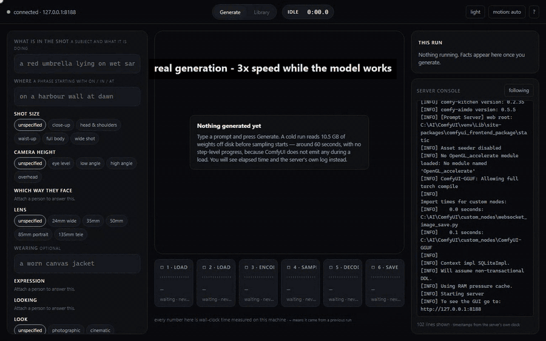

<sub>Real generation on an RTX 4060 Laptop, not a mock-up or replay: every stage, step count, preview frame and log line is live from ComfyUI. Build Idris from a sentence, compose a shot with the guided questions, watch the stages, then <i>make it night</i>. Stretches where the model is working are sped up (12x to 150x) and captioned with the factor. The shot was recorded in two sittings with the same prompt and seed, because the first sitting's browser timed out mid-run on a machine short of free RAM. Longer cut: [demo.mp4](docs/media/demo.mp4).</sub>

Backlot is a local image-generation studio for [Qwen-Image-2.1](https://github.com/QwenLM/Qwen-Image-2.1). You build a cast of characters, then shoot them again and again — new angle, new scene, new light — and they stay the same person. You compose shots by answering small questions instead of writing prompts, and you change a finished image by clicking *wider* or *make it night* rather than editing text.

It talks to a local [ComfyUI](https://github.com/comfyanonymous/ComfyUI). Nothing leaves your machine.

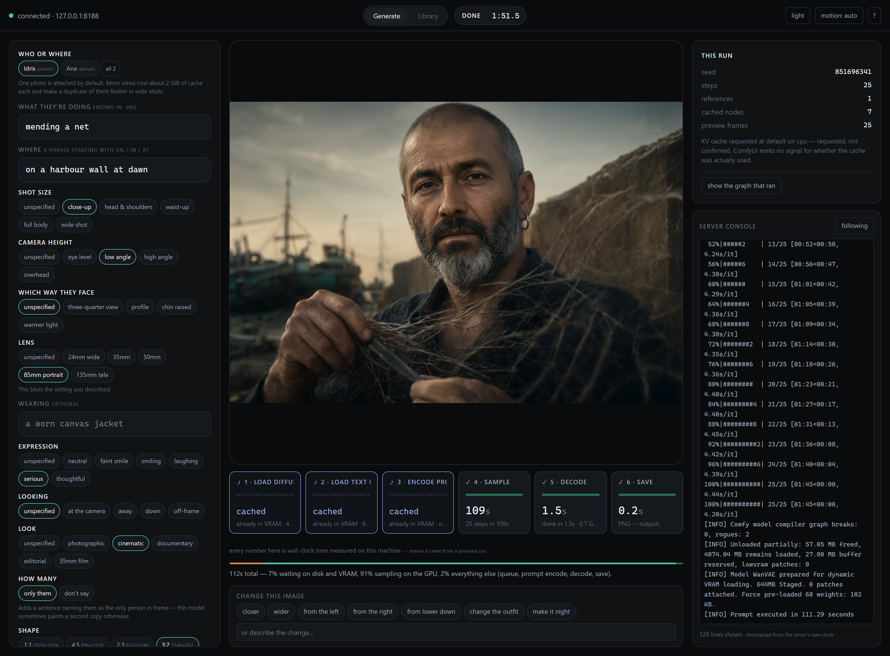

---

## Why it exists

Most local image tools give you a text box and a spinner. Two things are consistently painful:

**Characters don't persist.** Every run invents a new face, so you can't tell a story, build a set of assets, or iterate on a design.

**You can't see what's happening.** A 2-minute generation shows a bar that fills at a speed someone made up. When it's slow you have no idea why.

Backlot fixes both, and it is opinionated about the second one:

> **A filling progress bar is only ever used for a signal with a real numerator and denominator.** Sampling has one. Loading 10 GB of weights off disk does not — so that stage gets a sweep that never fills, an honest elapsed clock, and the server's own log, instead of a bar that lies.

Every number on screen is measured on your machine. Where a figure comes from a previous run it's prefixed `~` and labelled. Where the app can't know something, it says so rather than guessing.

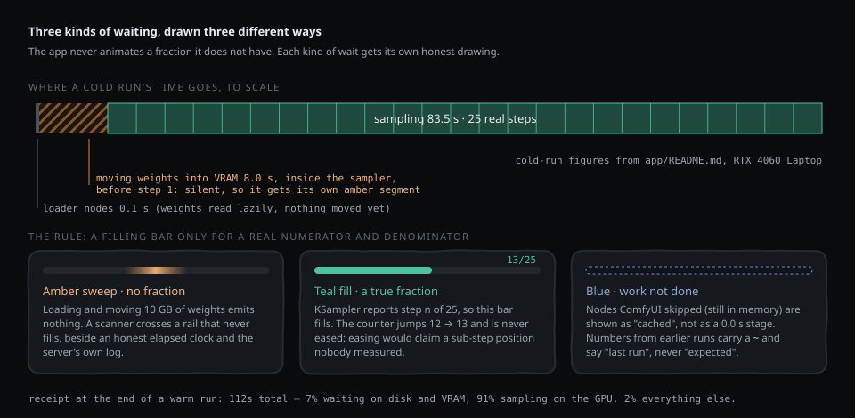

---

## What it does

### Build a cast — even with no photos

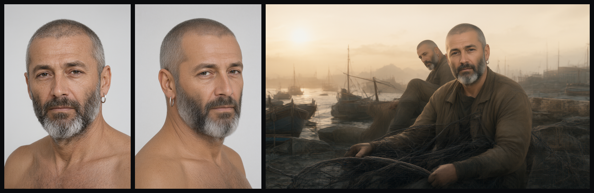

*Left to right: generated from a sentence · a new angle generated **from** that photo · dropped into a scene at a different aspect ratio.*

Describe someone — *"a bearded man in his fifties with deep-set eyes, close-cropped grey hair and a silver hoop earring"* — and Backlot generates a reference plate. Keep it, and you can generate extra views (*three-quarter*, *profile*, *chin raised*) that are made **from that photo**, so they're the same person rather than three strangers.

Already have photos? Drop them in instead.

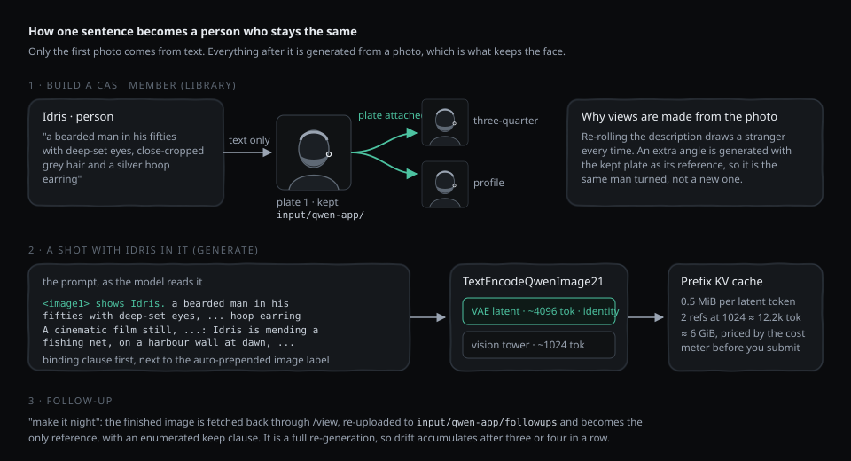

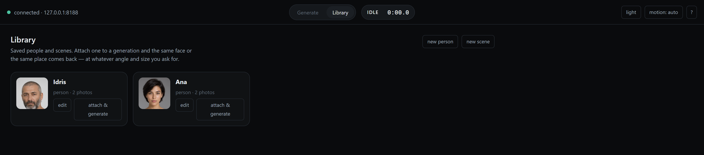

### Compose by answering questions

Type what they're doing and where. Everything else is chips: shot size, camera height, which way they face, lens, wardrobe, expression, gaze, look, how many people, shape.

An unanswered question adds **no words** — every row has a real "unspecified" chip, so leaving one alone is a visible choice, not a hidden default.

Chips write the prompt, and **"show what the model will read"** prints the exact string that gets submitted. If you'd rather write it yourself, *edit as text* hands it over.

### Change a finished image

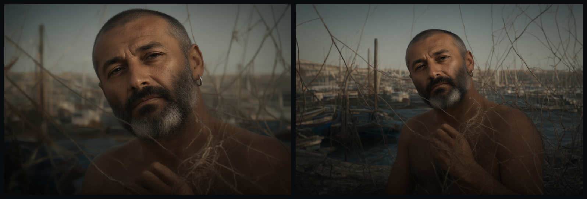

*One click of "wider" — same man, same pose, same net, same light.*

`closer` · `wider` · `from the left` · `from the right` · `from lower down` · `change the outfit` · `make it night` — or describe the change. The finished image becomes the reference, so the composition survives.

Each follow-up is honest about what it is:

> Each follow-up is a full re-generation, not an edit of the pixels. The previous image goes back through the VAE and the model paints a new one. Small changes accumulate — after three or four in a row the face has usually moved.

### Watch it work

The timeline shows the six real pipeline stages with true state and measured durations — including the stages ComfyUI **skipped** because they were already in VRAM. At the end you get a receipt:

```
112s total — 7% waiting on disk and VRAM, 91% sampling on the GPU, 2% everything else.
```

Frames from the recorded session:

| Loading: amber sweep, no fraction | Sampling: real steps, live preview, server log |
|---|---|
| 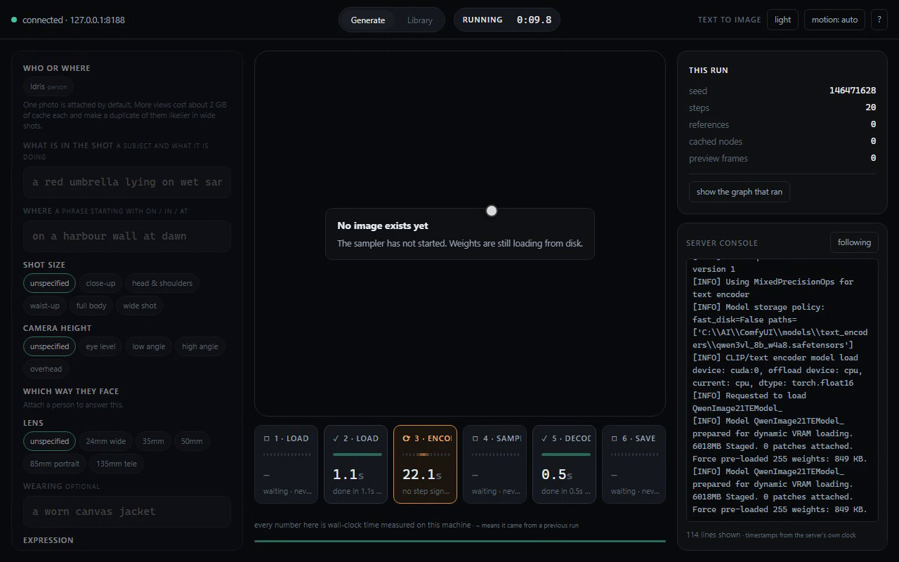 | 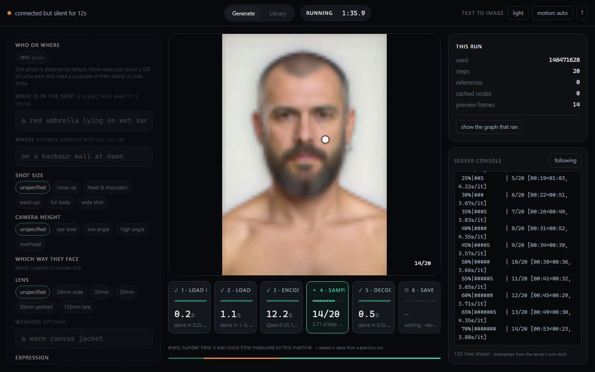 |
| 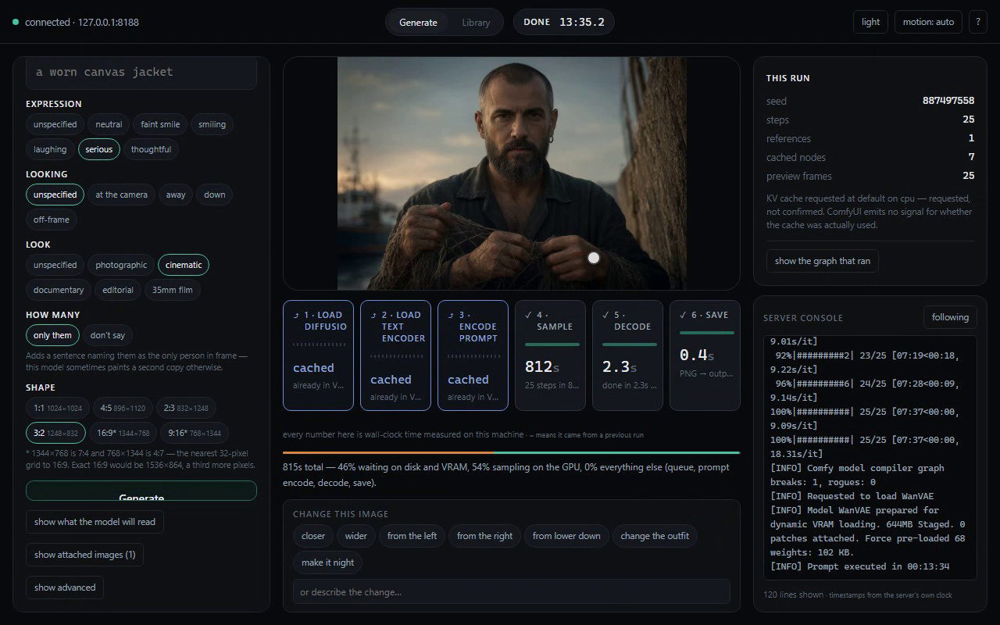 | 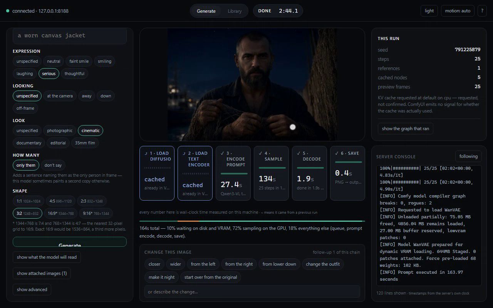 |


---

## How it works

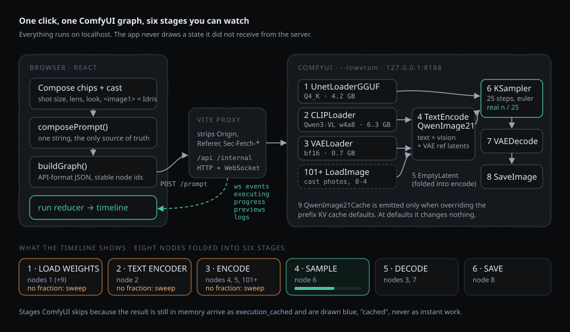

The browser composes one prompt string from the chips and the cast, builds an API-format ComfyUI graph with stable node ids, and POSTs it through Vite's proxy. Everything the timeline shows comes back over ComfyUI's websocket (`executing`, `execution_cached`, `progress`, preview frames, log lines) and is folded by a pure reducer into segments that tile the run with no gaps. If a stretch of time can't be attributed to a message, it's drawn as *unattributed* rather than absorbed into a neighbour.

The long silence in a cold run is really two different waits: loader nodes that return in 0.1 s because weights are read lazily, and the transfer into VRAM that happens *inside* the sampler, before its first step. The timeline shows them separately, because calling the second one "sampling 0/25" would be the lie this app exists to avoid.

---

## Requirements

| | |
|---|---|
| GPU | NVIDIA, **8 GB VRAM** is enough (developed on an RTX 4060 Laptop) |
| RAM | 16 GB minimum, 24 GB comfortable — the KV cache lives here. Free RAM matters more than the number on the box: recording the demo with other programs holding most of it (~3 GB free), a one-reference run took 40–100 s per step against ~4 s for a plain run |
| Disk | ~12 GB for weights |
| OS | Windows (the launch scripts are `.bat`; everything else is cross-platform) |
| Node | 20+ |

A 1024×1024, 25-step image takes about **100 seconds** cold and **60** warm on a 4060 Laptop.

---

## Install

### 1. ComfyUI

```bash
git clone --depth 1 https://github.com/comfyanonymous/ComfyUI.git C:\AI\ComfyUI
cd C:\AI\ComfyUI
python -m venv venv
venv\Scripts\python.exe -m pip install torch torchvision torchaudio --index-url https://download.pytorch.org/whl/cu128
venv\Scripts\python.exe -m pip install -r requirements.txt gguf
```

> Keep ComfyUI outside any cloud-synced folder. Ten gigabytes of weights syncing to OneDrive is not a good time.

### 2. The GGUF loader

Use the **leejet** fork — the widely-linked city96 one is unmaintained and does not load Qwen-Image-2.1.

```bash
git clone --depth 1 https://github.com/leejet/ComfyUI-GGUF.git C:\AI\ComfyUI\custom_nodes\ComfyUI-GGUF
```

### 3. The models

| File | Put it in | Size |
|---|---|---|
| [`qwen_image_2.1-Q4_K.gguf`](https://huggingface.co/leejet/Qwen-Image-2.1-GGUF) | `models\unet\` | 4.2 GB |
| [`qwen3vl_8b_w4a8.safetensors`](https://huggingface.co/Comfy-Org/Qwen-Image-2.1/tree/main/text_encoders) | `models\text_encoders\` | 6.3 GB |
| [`qwen_image_2.1_vae_bf16.safetensors`](https://huggingface.co/Comfy-Org/Qwen-Image-2.1/tree/main/vae) | `models\vae\` | 0.7 GB |

On 8 GB use the **w4a8** text encoder, not the bf16 one — bf16 alone is 17 GB.

### 4. Backlot

```bash
git clone https://github.com/duc-minh-droid/backlot.git
cd backlot/app
npm install
```

---

## Run

Start ComfyUI first and leave it running:

```bash
run-comfyui.bat
```

Then, in a second terminal:

```bash
run-app.bat
```

Open **http://127.0.0.1:5173**.

<details>
<summary>Not on Windows, or prefer to run the commands yourself</summary>

```bash
# terminal 1
cd C:\AI\ComfyUI && venv\Scripts\activate && python main.py --lowvram --use-pytorch-cross-attention

# terminal 2
cd backlot/app && npm run dev
```
</details>

### Why there's a proxy

ComfyUI refuses cross-origin requests with a hard **403** — not a missing CORS header — unless it's started with `--enable-cors-header`. A port-only difference counts, so no dev-server port avoids it, and it applies to the WebSocket handshake too.

Backlot's Vite config proxies everything and strips the browser's `Origin`, so ComfyUI needs no special flags. `changeOrigin: true` alone is *not* enough — it rewrites `Host` and leaves `Origin` intact. You can prove the proxy is doing work:

```bash
curl http://127.0.0.1:5173/api/system_stats                                   # 200
curl -H "Origin: http://127.0.0.1:5173" http://127.0.0.1:8188/system_stats    # 403
```

---

## Where things go

Generated images are written by ComfyUI to `ComfyUI\output\`. Reference photos are uploaded to `ComfyUI\input\qwen-app\`, and follow-up chains to `ComfyUI\input\qwen-app\followups\`. Your library itself is just pointers in `localStorage` — which is also why deleting a character can't delete its files, and the app says so instead of pretending.

There's also `gen.py`, a dependency-free CLI for headless generation.

**[`app/README.md`](app/README.md)** goes deeper: the websocket contract, the prompt grammar, the
reference-image wiring, and the traps that will bite anyone extending this.

---

## A few things learned the hard way

Measured on a 4060 Laptop, and baked into the defaults:

- **The prefix KV cache is already on** for every run. Adding ComfyUI's `QwenImage21Cache` node at its default values changes nothing — so Backlot only emits it when overriding. At `device: cpu` a two-reference run took **57s** against **75s** for the implicit default and **95s** with the cache off.
- **`dtype: int8` crashes** here with `aimdo memory compile error`, so it's never chosen automatically despite halving the cache.
- **The KV cache costs 0.5 MiB per latent token** (2 × 32 blocks × 4096 dim × 2 bytes). Two references at a 1024 budget is ~12,200 tokens ≈ **6 GiB**. The cost meter computes this before you submit, because it's what predicts an out-of-memory.
- **Identity comes from the VAE reference latents,** not the vision tower — roughly 4096 tokens per reference against 1024. Disconnecting the VAE fails *silently*: the model still "sees" the photo and produces someone who merely resembles it.
- **A prompt beginning with `<|im_start|>` silently drops every reference image.** Backlot blocks it.

---

## Project layout

```
app/                 the React/Vite studio (see app/README.md for the internals)
  src/comfy/         websocket + REST transport, binary preview frames
  src/graph/         buildGraph(): the ComfyUI API prompt, node ids and stage folding
  src/run/           pure run reducer, segment derivation, stage view model
  src/library/       cast, prompt composition, follow-ups, KV-cache cost model
  src/ui/            components
gen.py               dependency-free CLI for headless generation
workflows/           the plain text-to-image workflow gen.py submits
run-comfyui.bat      starts ComfyUI with --lowvram
run-app.bat          starts the app on http://127.0.0.1:5173
docs/                screenshots, docs/media/ for the demo and diagrams
```

---

## Built with

[Qwen-Image-2.1](https://github.com/QwenLM/Qwen-Image-2.1) · [ComfyUI](https://github.com/comfyanonymous/ComfyUI) · [ComfyUI-GGUF](https://github.com/leejet/ComfyUI-GGUF) · Vite · React · [Motion](https://motion.dev)

Model weights are under the **Qwen Research License** — check its terms before commercial use. The code in this repository is MIT.
